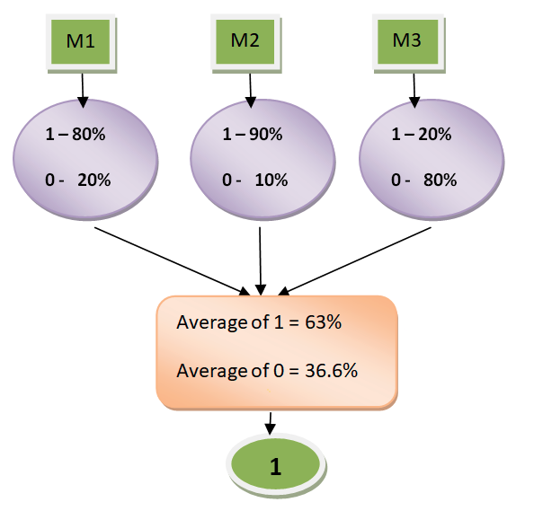

### [Ensemble Learning and Random Forest](https://my.ine.com/course/ensemble-learning-and-random-forest/2f29600c-05b1-43d4-b2cf-2fa82cf103e5)

# Build an ensemble voting classifier

In this project I will be building a Voting classifier to aggregate the findings of different classifiers to predict the output class based on combined majority of voting for each output class.

> This project is part of our [Ensemble Learning and Random Forest](https://my.ine.com/course/ensemble-learning-and-random-forest/2f29600c-05b1-43d4-b2cf-2fa82cf103e5) course.

